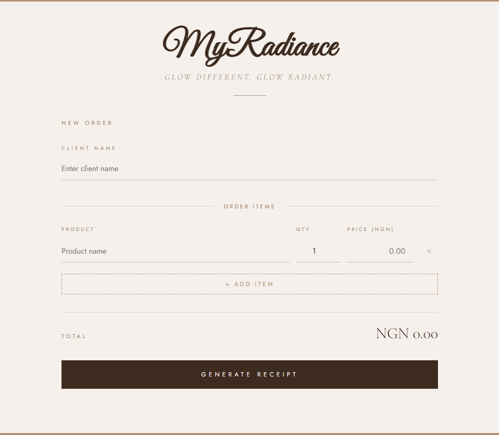
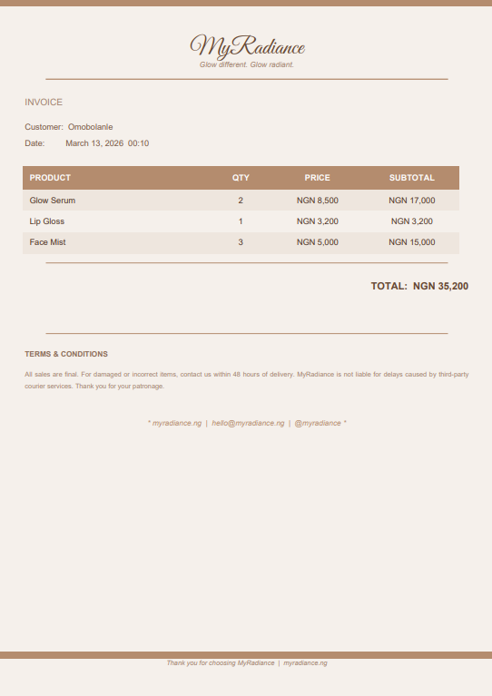

# MyRadiance Receipt API

A receipt generation API with a branded UI. Built with Python, Flask, and React.




## What it does

A small business owner adds a client name and order items in the UI. 
The app calls the API, which generates a professional branded PDF receipt 
and downloads it automatically. No Postman needed.

## Tech Stack

**Backend**
- Python 3
- Flask — REST API
- FPDF2 — PDF generation
- Flask-CORS — cross-origin requests

**Frontend**
- React + Vite
- Axios — API calls

## Running Locally

**Backend**
```bash
cd receipt-api
venv\Scripts\activate
python app.py
```

**Frontend**
```bash
cd frontend
npm run dev
```

## API

**POST** `/generate-receipt`
```json
{
  "customer": "Amaka",
  "items": [
    {"name": "Glow Serum", "qty": 2, "price": 8500}
  ]
}
```

Returns a downloadable PDF receipt.

## Author

**Omobolanle Sadela**  
[GitHub](https://github.com/bolanlesadela) · [LinkedIn](https://www.linkedin.com/in/omobolanle-sadela-7a486a1b4/)